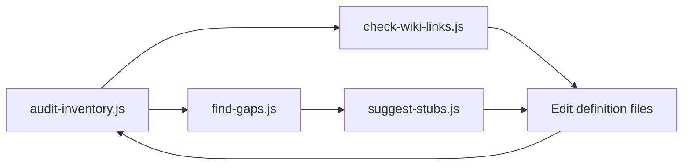

# AI maintenance playbook

Scripts for keeping MTA Lua definition files accurate and wiki-linked.

**Requirements:** Node.js 18+ (`node --version`). No `npm install` needed.

## Workflow



## When to run

| Trigger | Command |
|---------|---------|
| After editing any `__*_definitions*.lua` | `node scripts/check-wiki-links.js --file <file> --skip-network` |
| Before PR | `node scripts/audit-inventory.js` then `node scripts/check-wiki-links.js` |
| MTA version bump / rescan | `node scripts/find-gaps.js` then `node scripts/suggest-stubs.js` |
| Verify live wiki URLs | `node scripts/check-wiki-links.js` (no `--skip-network`) |

From `scripts/` you can also run: `npm run inventory`, `npm run wiki`, `npm run gaps`, `npm run stubs`.

## Codegraph (fast symbol lookup)

This repo is indexed under `.codegraph/` (local only, gitignored). Use Codegraph when you need **one function's exact location** or **related APIs in context** — faster than grep + Read loops.

After editing definition files, sync the index:

```bash
codegraph sync
```

| Goal | Command |
|------|---------|
| Find a function by name | `codegraph query createVehicle -k function -l 20` |
| Jump to symbol + line | `codegraph node dbConnect` |
| Explore an API area | `codegraph explore "server database dbConnect dbPoll"` |
| See symbol counts per file | `codegraph files` |
| Full inventory stats | `codegraph status` |

In Cursor chat, use the **codegraph_explore** MCP tool with `projectPath` set to this repo root and a query like `setElementPosition __shared_definitions` — it returns line-numbered source for matching symbols in one call.

**When to use which:**

- **Codegraph** — locate symbols, browse clusters (DB, camera, bans), verify line numbers before edits
- **`audit-inventory.js`** — wiki-link status, descriptions, deprecation flags across all files
- **`check-wiki-links.js`** — validate `[Wiki]` URL format and casing

## Conventions

### Wiki link format

```lua
--[[
[Wiki](https://wiki.multitheftauto.com/wiki/GetCameraFieldOfView)
]]
---@type fun(...): ...
function getCameraFieldOfView() end
```

- URL rule: `https://wiki.multitheftauto.com/wiki/` + **PascalCase** function name
- Merge into existing `--[[ ]]` blocks as the **first line**
- Functions without wiki pages go in `scripts/wiki-exceptions.json` with a GitHub/source `alt` URL

### Definition files scanned

- `__*_definitions*.lua` in repo root
- `addEventHandler/__*_definitions*.lua`
- Excludes `types/` from function inventory scripts (type aliases only)

### Type definition files (`types/`)

These files use `---@alias` / `---@class`, not function stubs — they are **not** covered by `check-wiki-links.js`.

- Link to **wiki topic pages** (e.g. `Vehicle_IDs`, `Control_names`), not PascalCase function names
- Use the same `[Wiki](url)` markdown inside `--[[ ]]` blocks above the alias when a wiki page documents the enum/table
- Many aliases embed full ID tables locally; wiki links are optional but recommended for the largest reference tables

## Scripts

### `audit-inventory.js`

Full inventory with side, wiki-link status, descriptions, deprecation flags.

Output: `scripts/reports/inventory.json`, `inventory.md`

### `check-wiki-links.js`

Finds missing, wrong-casing, duplicate, or broken wiki links. Exit code `1` on problems (CI-friendly).

Output: `scripts/reports/wiki-audit.json`

### `find-gaps.js`

Compares repo inventory against MTA wiki categories (default) or a local `mtasa-blue` clone (`--mtasa-blue`).

Output: `scripts/reports/gaps.json`

### `mtasa-blue-functions.js`

Extracts Lua functions from a local [mtasa-blue](https://github.com/multitheftauto/mtasa-blue) checkout and maps each to the correct annotation file. **Only scans** `Client/mods/deathmatch/logic/luadefs/*.cpp` and `Server/mods/deathmatch/logic/luadefs/*.cpp` — not the whole `Server/` tree.

```bash
node scripts/mtasa-blue-functions.js --mtasa-blue C:/path/to/mtasa-blue
node scripts/mtasa-blue-functions.js --mtasa-blue ../mtasa-blue --side server
node scripts/mtasa-blue-functions.js --mtasa-blue ../mtasa-blue --compare
node scripts/mtasa-blue-functions.js --mtasa-blue ../mtasa-blue --name getPostFXValue
node scripts/mtasa-blue-functions.js --mtasa-blue ../mtasa-blue --source CLuaBanDefs.cpp
```

Output: `scripts/reports/mtasa-blue-functions.json` (and optional `.md` with `--format md`)

Pass the **repo root** (parent of `Server/` and `Client/`), not `Server/` itself.

### `verify-syntax.js`

Compares `---@type fun(...)` annotations in this repo against mtasa-blue handler signatures:

- **ArgumentParser** — parses C++ static method signatures (skips `lua_State*`)
- **Legacy handlers** — parses `// functionName ( [ types... ] )` comment lines above `CScriptArgReader` code

```bash
node scripts/verify-syntax.js --mtasa-blue C:/path/to/mtasa-blue
node scripts/verify-syntax.js --mtasa-blue ../mtasa-blue --name getPostFXValue
node scripts/verify-syntax.js --mtasa-blue ../mtasa-blue --side server --format md
```

Output: `scripts/reports/syntax-verify.json` (and optional `.md`)

Statuses: `ok`, `mismatch`, `missing_annotation`, `unverifiable` (no parseable source / varargs / external handler in `CStaticFunctionDefinitions`), `skipped` (alias/union annotations).

### `suggest-stubs.js`

Prints paste-ready stubs from `gaps.json` or `--name FunctionName`.

## Adding a new function

1. Run `node scripts/find-gaps.js` to confirm it is missing
2. Run `node scripts/suggest-stubs.js --name newFunctionName`
3. Paste stub into the correct definition file; refine types from wiki
4. Run `node scripts/check-wiki-links.js --file <file>`

## Reports

Generated under `scripts/reports/` (gitignored). Commit script and definition changes only.
